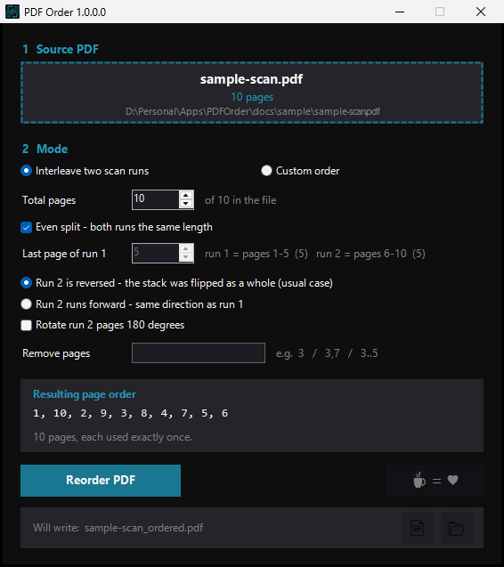

# PDF Order

A small Windows app that puts a scanned PDF back into reading order.

If your scanner can only do one side of a page at a time, you scan all the fronts,
flip the whole stack over, and scan again. The second pass comes out **backwards**,
so the file reads 1, 2, 3 … then 10, 9, 8 … instead of 1, 2, 3, 4. PDF Order
interleaves the two runs back together. It can also take a page order you type by
hand, and drop pages you do not want.

The original file is never modified. The result is written next to it as
`<name>_ordered.pdf`, and an existing result is never overwritten — a number is
added instead.



## The problem, with numbers

A 10-page document scanned in two passes arrives like this:

| | pages |
|---|---|
| run 1 (fronts) | 1, 2, 3, 4, 5 |
| run 2 (backs) | 6, 7, 8, 9, 10 — but in reverse |
| **what you want** | **1, 10, 2, 9, 3, 8, 4, 7, 5, 6** |

That last row is exactly what the app produces. `docs/sample/sample-scan.pdf` is a
numbered 10-page file you can drop in to watch it happen.

## Two modes

### Interleave

Point it at the file and it reads the page count itself. By default it splits the
document in half — 10 pages becomes run 1 = 1-5 and run 2 = 6-10 — and assumes the
second run is reversed, which is what flipping the stack produces. Both assumptions
are overridable:

- **Total pages** — pages past this number take no part and are kept at the end.
- **Last page of run 1** — the split point, if the two runs were not equal.
- **Run 2 direction** — reversed (the usual case) or forward.
- **Rotate run 2 by 180°** — some scanners produce upside-down back sides.
- **Remove pages** — e.g. `3`, `3,7`, `3..5`.

### Custom order

Type the order yourself.

| Syntax | Meaning |
|---|---|
| `1.5.4.3.6.2` | those six pages, in that order |
| `1..5` | pages 1 to 5 |
| `10..6` | pages 10 down to 6 |
| `-3` | remove page 3 |

`,` `;` `/` and spaces also separate, so a list pasted from elsewhere parses.

**`-` is not a separator — it always means remove.** `1-5-4` reads as "page 1,
remove 5, remove 4", which gives just page 1. Use `.` between pages.

Removals apply to the finished list wherever the page sits, so
`1..5 -3 10..6` gives `1, 2, 4, 5, 10, 9, 8, 7, 6`. Typing only removals means
"the whole file, minus these".

Whatever you type, the resulting order is shown before anything is written.

## Install

### Download

Grab `PDF Order <version>.exe` from the [Releases](../../releases) page. One file,
no installer, nothing to set up.

> **The .exe is not code-signed.** Windows SmartScreen will warn you
> ("Windows protected your PC" → *More info* → *Run anyway*), and some antivirus
> products are suspicious of PowerShell-compiled executables on principle. If you
> would rather not take that on trust, build it yourself — it takes one command.

### Build from source

Needs [PowerShell 7](https://github.com/PowerShell/PowerShell) and the
[ps2exe](https://github.com/MScholtes/PS2EXE) module:

```powershell
Install-Module ps2exe -Scope CurrentUser
pwsh -File build\build.ps1
```

That downloads PDFsharp from NuGet, caches it in `build\lib\`, inlines it into a
temporary copy of the script, and compiles a single self-contained `.exe`. The
source `.ps1` is never modified.

To run the script directly instead of compiling, fetch the library once and start it:

```powershell
pwsh -File build\build.ps1 -SkipExe
powershell -STA -File ".\PDF Order 1.0.0.0.ps1"
```

## Tests

```powershell
pwsh -File test\verify.ps1
```

15 checks covering the page-order maths, the custom-order parser, the removal
syntax, output-name collisions, and a real PDF round-trip. The suite builds its own
numbered sample PDFs, so it needs no fixtures and touches nothing outside its temp
folder.

## How it works

PowerShell has no PDF engine, so the app uses **PDFsharp** for all reading and
writing. Pages are copied across untouched — the page content streams in the output
are byte-identical to the source, so nothing is re-encoded and image quality is
unchanged.

PDFsharp is not committed to this repository. `build\build.ps1` fetches the official
NuGet package and embeds it at build time, which is what keeps the shipped `.exe` a
single file while leaving the source readable.

Requires Windows. Built with WinForms; no network access, no telemetry, no settings
file — it reads the PDF you give it and writes one next to it.

## Licence

MIT — see [LICENSE](LICENSE).

Bundled third-party code and its licence: [THIRD-PARTY.md](THIRD-PARTY.md).
